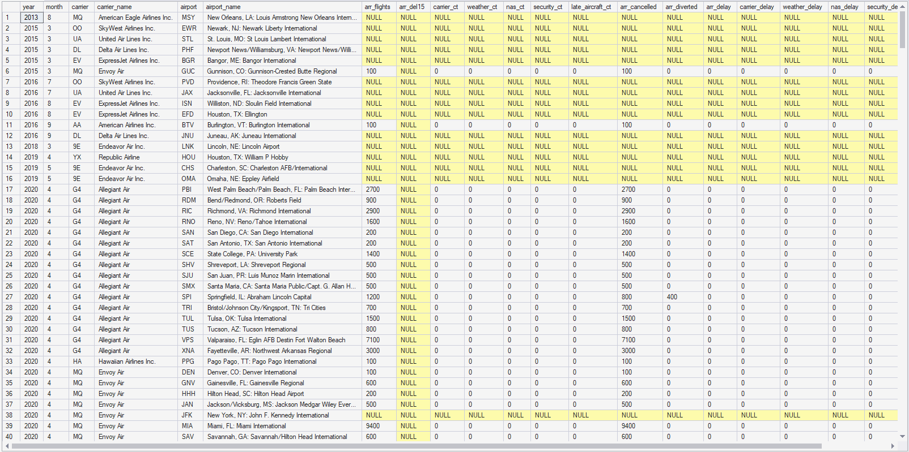
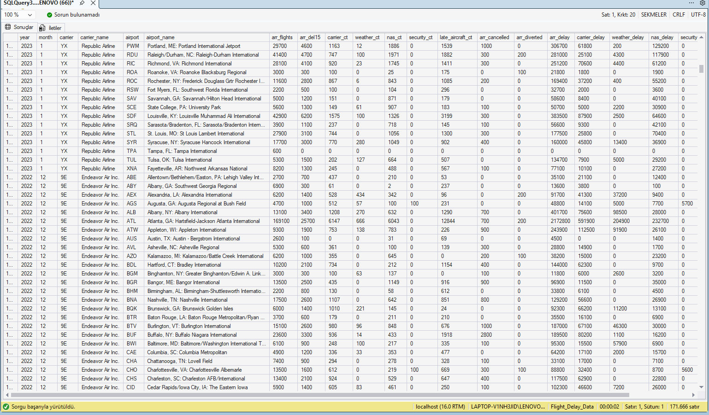
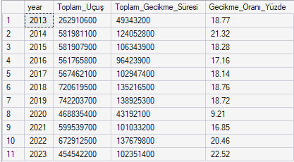
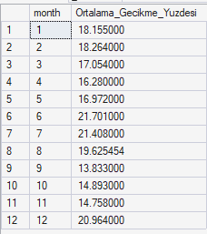
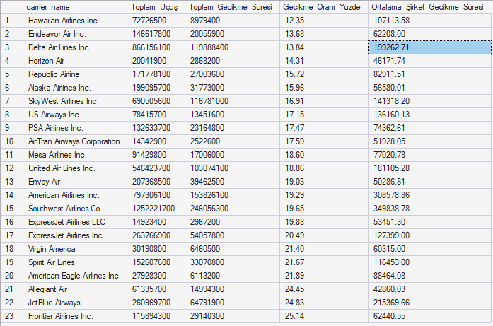
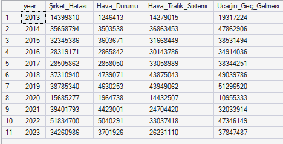
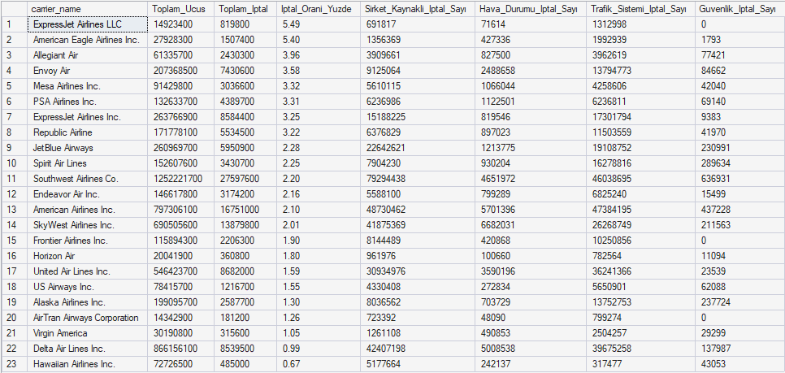
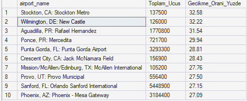

## 📌 Proje Hakkında
-- Airline Delay & Cancellation Analysis (2013-2023)
 Bu proje, 2013-2023 yılları arasındaki havayolu gecikme ve iptal verilerini kullanarak havacılık sektöründeki operasyonel performansı analiz eder. 
SQL Server üzerinde gerçekleştirilen bu çalışma, ham verinin temizlenmesinden fiziksel optimizasyonuna ve veri hikayeleştirme aşamasına kadar tüm süreçleri kapsar.

-- ## 🛠️ Uygulanan Teknik Süreçler
1. Veri Temizleme & Hazırlık (Data Cleaning)
Data Imputation: arr_flights (toplam uçuş) değeri bulunan ancak gecikme detayları NULL olan satırlar, operasyonel mantık gereği 0 ile doldurularak veri bütünlüğü sağlandı. Gereksiz Veri Ayıklama: Hiçbir uçuş kaydı içermeyen (arr_flights IS NULL) satırlar, analizde sapma yaratmaması adına veri setinden çıkarıldı.

Veri Tipleri: Matematiksel hesaplamaların (ortalama, oran vb.) doğruluğu için sayısal sütunlar uygun formatlara dönüştürüldü.

2. Veritabanı Optimizasyonu (Clustered Index)
Tablo yapısı başlangıçta "Heap" (düzensiz) formdayken, sorgu performansını artırmak ve veriyi kronolojik bir düzene sokmak için year ve month sütunları üzerinde Clustered Index oluşturuldu. Bu işlemle veriler disk üzerinde fiziksel olarak 2013'ten 2023'e doğru sıralandı, böylece sorgularda daha mantıklı sorgular elde edildi. Yeni veri ekleme işlemleri kolaylaştırıldı.

Clustered_Index Yapısı: 

3. Kullanılan Uygulamalar ve Yöntemler
 Database: SQL Server
Optimization: Clustered Indexing
Analysis: Advanced SQL Queries (CTE, Aggregate Functions, CAST/CONVERT, NULLIF)

-- ## 📈 Önemli Analiz Bulguları

 1) Yıllık ve Mevsimsel Trendler:
Pandemi Etkisi (2020): Toplam uçuş sayısının azalmasıyla birlikte gecikme oranlarının %9.21 ile tarihi bir dip seviyeye gerilediği gözlemlendi.

Mevsimsellik: Haziran ve Temmuz ayları (yaz yoğunluğu) %21 üzerindeki gecikme oranlarıyla en riskli dönemler olarak belirlenirken; Eylül ayı %13.83 ile yılın en stabil ayı olarak öne çıkmaktadır.

2) Havayolu Performansları
Operasyonel Liderler: Endeavor Air Inc, Delta Air Lines ve Hawaiian Airlines, devasa uçuş hacimlerine rağmen en düşük gecikme ve iptal oranlarını yakalayarak operasyonel verimlilikte zirvede yer almaktadır.

Gecikme Nedenleri: Toplam gecikmelerin ana kaynağının hava durumu değil, "Uçağın Geç Gelmesi" (Late Aircraft) ve "Şirket Hataları" (Carrier Delay) olduğu saptandı.

3) Uçuş İptalleri ve Nedenleri
İptallerin büyük çoğunluğunun havayolu şirketlerinden ziyade "Hava Trafik Sistemi" (NAS) kaynaklı olduğu görüldü.
Bölgesel havayollarının (örn. ExpressJet), ana taşıyıcılara göre çok daha yüksek iptal oranlarına sahip olduğu sayısal verilerle kanıtlandı.

4) En çok gecikmelerin olduğu hava limanları.

